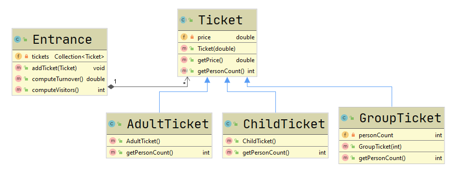

# Zoo Entrance

## Inhalte

- Klassendiagramme
- Vererbung

## Beschreibung

Zur Verwaltung der Eintrittskasse eines Zoos sollen Ticketklassen erstellt werden. Der Zoodirektor beschreibt die Zusammenhänge folgendermaßen:

> Jedes Ticket besitzt einen Preis. Es werden Tickets für Kinder, Erwachsene und Gruppen angeboten. Kinder zahlen keine Eintritt, Erwachsene zahlen 14,70 Euro und Gruppen zahlen 50 Euro Eintritt. Bei jedem Gruppenticket soll die Anzahl der Personen gespeichert werden. 

Die Klasse `Entrance`soll das Tagesgeschehen des Zooeingangs repräsentieren. In der Klasse wird eine beliebige Anzahl an Tickets verwaltet. Außerdem bietet sie Funktionen zur Berechnung des Tagesumsatzes und der Besucherzahl.

## Aufgabenstellung

Setzen Sie das abgebildete Klassendiagramm anhand der obigen Beschreibung in einer Java Applikation um:

**Tipp:** Instanzieren Sie für die `Collection tickets` eine `ArrayList`.

## Test

Implementieren Sie in der `main()`-Methode einen Testfall mit folgenden Zoobesuchern:

- eine Gruppe mit 6 Personen
- zwei Erwachsene mit drei Kindern

Die erwarteten Ergebnisse sind daher:

- Besucherzahl: 11
- Umsatz: 79,40 Euro

## Zusatzaufgabe

Formatieren Sie die Ausgabe des Tagesumsatzes wie im folgenden Screenshot:

