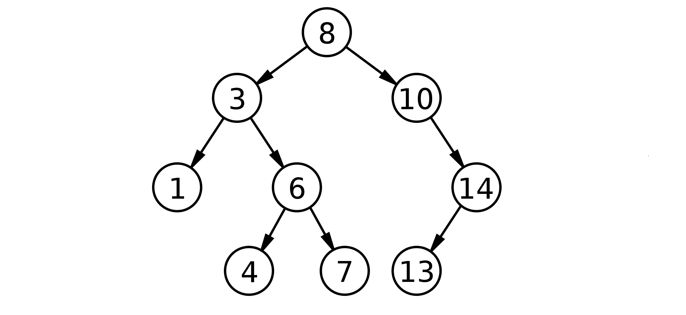
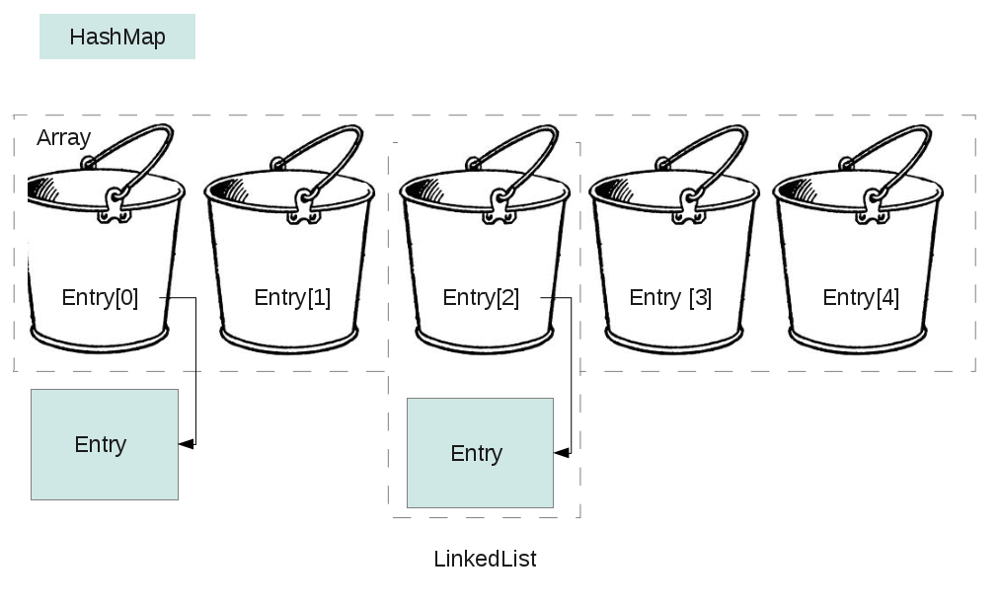

# Collections

The package [java.util](https://docs.oracle.com/en/java/javase/15/docs/api/java.base/java/util/package-summary.html) contains all classes and interfaces of the [Collections Framework](https://docs.oracle.com/en/java/javase/15/docs/api/java.base/java/util/doc-files/coll-overview.html). 

## Collection Interfaces

Most *collection interfaces* are based on `java.util.Collection`. For example:

- `java.util.List`
- `java.util.Set`
- `java.util.Queue`

The other collection interfaces are based on `java.util.Map` and so are not true collections. However, these interfaces contain *collection-view* operations, which enable them to be manipulated as collections.

## List Implementations

`ArrayList` and `LinkedList` are implementations of the `List` Interface. We already covered them in detail.

A `Stack` is a LIFO (last in, first out) `List` which allows to push / pop elements in constant time.

## Set Implementations

A `Set` is a `Collection` that stores unique elements. The most popular implementations of this interface are:

- `HashSet`
  - uses a `HashMap` to store the elements
  - doesn't maintain insertion order of the elements
  - allows elements to be `null`
- internally stores the elements in a `HashMap` (see next section)
  
- `TreeSet`
  - uses a self-balancing binary search tree to store the elements
  - sorts the elements ascending according to the natural order
  - therefore requires elements to implement `Comparable`
  - doesn't permit nulls
  - internally stores the elements in a binary tree:

## Map Implementations

A `Map` you can store key-value-pairs - every key is mapped to exactly one value. You can use the key to retrieve the corresponding value from the map. `HashMap` is one of the most popular implementations of this interface.

But why not simply add the key-value-pairs to a list? The reason is performance. Instead of iterating over all its elements, a`HashMap` calculates the position of a value based on its key. Therefore, `HashMap` stores the elements in so-called buckets. 

- When you put a key-value-pair in the map, the key's `hashCode()` method is used to determine the bucket where it will be stored.
- To retrieve a value, `HashMap` calculates the bucket in the same way – using the key's `hashCode()`. Then it iterates through the objects found in that bucket and uses the key's `equals()` method to find the exact match.

To make sure that `HashMap` works correctly, you have to maintain the *general contract* of the `hashCode()` method: 

**Equal objects must have equal hash codes! **

So it is necessary to override the `hashCode()` method whenever the `equals()` method is overridden.

## Further reading

- https://www.baeldung.com/java-stack
- https://www.baeldung.com/java-hashset
- https://www.baeldung.com/java-tree-set
- https://www.baeldung.com/java-hashmap

