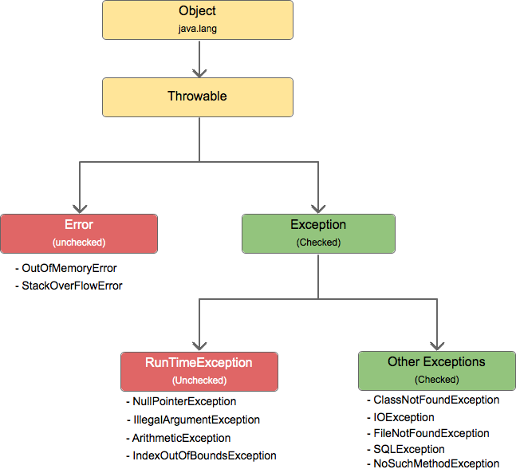

# Exception Handling

## 1 Why we need exception handling

We usually write code in an idealized environment: 

- the filesystem always contains our files
- the network is healthy
- the JVM always  has enough memory. 

Sometimes we call this the *happy path*.

In production, though, filesystems can corrupt, networks break down,  and JVMs run out of memory. The wellbeing of our code depends on how it deals with *unhappy paths*. 

Without handling exception, an otherwise healthy program may stop running altogether! **We need to make sure that our code has a plan for when things go wrong.**

## 2 Exception Hierarchy

Exceptions are just Java objects which **extend `Throwable`**:

There are **three main categories** of exceptional conditions:

- **checked exceptions**
  - extends `Exception` but not `RunTimeException`
- **unchecked exceptions** (aka **runtime exceptions**)
  - extends `RunTimeException`
- **errors**

### 2.1 Checked Exceptions

Checked exceptions are exceptions that the **Java compiler requires us to handle**:

- either we throw the exception up the call stack (via `throws` in the method signature) 
- or we handle it ourselves (via `try`-`catch`-block) 

[Oracle's documentation](https://docs.oracle.com/javase/tutorial/essential/exceptions/runtime.html) tells us to use checked exceptions when we can **expect the application to be able to recover**.

Examples: `IOException`, `SQLException`

### 2.2 Unchecked Exceptions

Unchecked exceptions are exceptions that the **Java compiler does *not* require us to handle**.

[Oracle's documentation](https://docs.oracle.com/javase/tutorial/essential/exceptions/runtime.html) tells us to use unchecked exceptions when the **application cannot recover from the exception**.

One case where it is common practice to throw a `RuntimeException` is when the user calls a method incorrectly. For example, a method can check if one of its arguments is incorrectly `null`. If that's the case, the method might throw a `NullPointerException` or an `IllegalArgumentException` - both are an unchecked exceptions.

Examples: `NullPointerException`, `IllegalArgumentException`, `IndexOutOfBoundsException`.

### 2.3 Errors

Errors represent serious and usually irrecoverable conditions like a library incompatibility, infinite recursion or memory leaks.

Those are **abnormal conditions that a application should not try to catch**. Instead we want these to propagate all the way up.

Examples: `StackOverflowError`, `OutOfMemoryError`

## 3 How to handle exceptions

Take a look at the *ExceptionsDemo*. There you find examples for handling exceptions with:

- **`throws`** in method signature
- **`try`-`catch`**
  - with multiple `catch`-blocks
    - for different exceptions
  - with union-`catch`-block 
    - catches multiple exceptions in the same block
- **`try`-`catch`-`finally`**
  - e.g. for manually closing a stream
- **`try`-`with`-`resources`**
  - e.g. for automatically closing a stream

## 4 How to throw exceptions

Again, take a look at the *ExceptionsDemo*. There you find examples for throwing:

- **built-in exceptions**
  - e.g. (unchecked) `IndexOutOfBoundsException`
- **custom exceptions**
  - checked (extends `Exception` but not `RuntimeException`)
  - unchecked (extends `RuntimeException`)

## Further Reading

- https://www.baeldung.com/java-exceptions
- https://www.baeldung.com/java-new-custom-exception
- https://www.manishsanger.com/java-exception-hierarchy/
- https://docs.oracle.com/javase/tutorial/essential/exceptions/runtime.html

