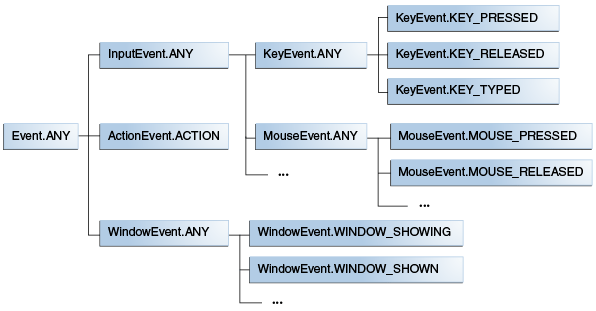

# JavaFX

JavaFX (aka OpenJFX) is a opensource library for building GUI applications for desktop, mobile and embedded systems.

## Main Structure

In the following image you can see the main structure of a JavaFX application:

- The **`Stage`** is the main container and the entry point of the application. It represents the main **window** and is passed as an argument of the `start()` method.
- A **`Scene`** is a container for holding the UI elements.
  - The visible `Scene` of the `Stage` can be replaced or switched to another *Scene*. 
  - Each `Scene` contains a `Pane` as single root node, which defines the layout of the `Scene`. For example `HBox`, `VBox`, `Border Pane`, `AnchorPane` or (as shown above) `StackPane`.
  - The root node can contain nodes like `TextField`, `Button`, `TableView` or even another `Pane`.
  - So you get graph of hierarchical objects, which is known as a **Scene Graph**. Each element (node) in this hierarchy can have its own ID, style, effects, event handlers, state.

## Lifecycle Methods

The `javafx.application.Application` class has the following lifecycle methods:

- `init()`
  - Is called after the application instance is created. 
  - At this point, the JavaFX API isn't ready yet, so we can't create graphical components here.
- `start(Stage stage)` 
  - All the graphical components are created here. 
  - Also, the main thread for the graphical activities starts here.
- `stop()`
  - Is called before the application shutdown, for example, when a user closes the main window. 
  - It's useful to override this method for some cleanup before the application termination.

The static `launch()` method is usually called in the `main()` method to start the JavaFX application.

## Views and Controllers

In JavaFX design and behaviour of the GUI are separated:

- JavaFX uses a special FXML markup language to create the view interfaces. But those *.fxml* files describe just the structure of the view content (which UI element should be displayed where).
- The behaviour of the view (loading/saving data, event handling) is implemented in a so called `Controller`. This is just a Java class that has access to the UI elements of the view. 

A `.fxml` file contains the name of the `Controller`. When the file is loaded, JavaFX creates an instance of the `Controller` and connects it via **Dependency Injection** with the UI elements.

You can load an *.fxml* file with the `FXMLLoader` class. As result you get a `Pane`  which contains the UI elements. This `Pane` can be used as the root node of the `Scene`.

## Events

In JavaFX applications, events are notifications that something has  happened. As a user clicks a button, presses a key, moves a mouse, or  performs other actions, events are dispatched. Registered event filters  and event handlers within the application receive the event and provide a response. 

In JavaFX, an event is an instance of the `javafx.event.Event` class or any subclass of `Event`. JavaFX provides several events, including `DragEvent`, `KeyEvent`, `MouseEvent`, `ScrollEvent`, and others. You can define your own event by extending the `Event` class.

### Event Types

Event types further classify the events of a single event class. For example, the `KeyEvent` class contains the following event types:

- `KEY_PRESSED`
- `KEY_RELEASED`
- `KEY_TYPED`

Event types are hierarchical. Every event type has a name and a super type. For example, the name of the event for a key being pressed is `KEY_PRESSED`, and the super type is `KeyEvent.ANY`. 

### Event Handling

Event handling is provided by **event filters** and **event handlers**, which are implementations of the `EventHandler` interface.

- First the **event filters**, which are registered at the `Stage`, are exectued. When those filters complete, the event is passed to the `Scene`, and then to the next node(s), until it finally arrives at the target node (e.g. `Button`).
- After the event target is reached and all registered filters have processed the event, the **event handlers** are executed, beginning with those registered at the target node (e.g. `Button`) and ending with those registered at the `Stage`.

An event can be **consumed** by an event filter or an event handler in the described chain by calling the `consume()` method. This method signals that processing of the event is complete and no further filters and handlers are executed.

## Binding

Relationships between JavaFX properties expressed via binding. Changes made to one property will automatically be reflected in the other property. This can be useful in a  variety of applications. For example, binding could be used in a bill  invoice tracking program, where the total of all bills would automatically be updated whenever an individual bill is changed. Or, binding could be used in a graphical user interface (GUI) that  automatically keeps its display synchronized with the application's  underlying data.

For more information take a look at the *Binding Demo*.

# Resources

- https://www.baeldung.com/javafx
- https://docs.oracle.com/javafx/2/binding/jfxpub-binding.htm
- https://docs.oracle.com/javafx/2/events/jfxpub-events.htm

